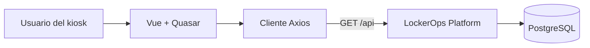

# LockerOps Kiosk

Interfaz de quiosco táctil para consultar estaciones de lockers y la disponibilidad
de sus compartimentos, con un flujo de reserva de prueba en local. La versión pública
del portfolio es de solo consulta; no procesa pagos.

El backend relacionado vive en
[LockerOps Platform](https://github.com/jaikostatham/lockerops-platform).

## Qué muestra

- Selección de estaciones y vista de compartimentos por estado.
- Detalle de un compartimento.
- Textos en español e inglés, con español como idioma inicial.
- Diseño pensado para una pantalla de quiosco táctil.

## Tecnologías

Vue 3 · Quasar · TypeScript · Vue Router · Vue I18n · Axios · Vite



## Ejecutar en local

Requisitos: Node.js 20.19 o posterior, o Node.js 22.12 o posterior, y el backend disponible en
`http://localhost:8080`.

```bash
npm ci
npm run dev
```

Vite sirve la interfaz en `http://localhost:9000` y reenvía `/api` al backend
local. Para probar con el backend en el puerto `8081`:

```powershell
$env:VITE_DEV_PROXY_TARGET = 'http://localhost:8081'
$env:VITE_RESERVATION_FLOW_ENABLED = 'false'
npm run dev
```

El frontend local llama al backend de IntelliJ con perfil `local`. El destino
de su base depende de `DB_HOST` y `DB_NAME` en la configuración de ejecución;
el backend usa `localhost:5432/lockerops_test` por defecto, pero IntelliJ puede
sobrescribirlo. La API local devuelve las mismas tres estaciones de ejemplo que
Neon testing, aunque eso no confirma que compartan servidor. Verifica esos dos
valores en IntelliJ antes de asumir que los cambios locales aparecerán en
testing. Los servicios públicos solo exponen el catálogo en modo lectura.
Producción está aislada en Neon `lockerops_prod`.

| Entorno | Rama | Frontend | API |
| --- | --- | --- | --- |
| Local | Rama de trabajo | `http://localhost:9000` | `http://localhost:8080` |
| Testing | `develop` | <https://lockerops-kiosk-frontend-test.onrender.com> | <https://lockerops-platform-test.onrender.com> |
| Producción | `main` | <https://lockerops-kiosk-frontend-prod.onrender.com> | <https://lockerops-platform-prod.onrender.com> |

## Configuración de API

En desarrollo, deja `VITE_API_BASE_URL` vacía para usar el proxy de Vite. En un
frontend desplegado, `VITE_API_BASE_URL` puede apuntar al origen HTTPS de la API.
Las variables `VITE_*` se incorporan al JavaScript que recibe el navegador, así que
son configuración pública y nunca deben contener contraseñas, tokens ni claves.

El valor debe ser solo el origen HTTPS del backend (sin `/api`); ese origen también
debe figurar en `CORS_ALLOWED_ORIGINS` del backend correspondiente. Los sitios
de Render usan el backend del mismo entorno. Para producción, el backend usa el
perfil `prod`, requiere secretos del proveedor y bloquea escrituras por defecto
mientras la API no tenga autenticación.

Los perfiles, las bases y las precauciones para sus datos están descritos en la
[guía PostgreSQL del backend](https://github.com/jaikostatham/lockerops-platform/blob/develop/docs/postgresql-environments.md).

## Contrato consumido

Todas las versiones usan estas rutas de consulta:

- `GET /api/locker-stations`
- `GET /api/locker-stations/{id}`
- `GET /api/locker-stations/{lockerStationId}/compartments`
- `GET /api/locker-compartments/{id}`

En local, el flujo de prueba también llama a `POST /api/reservations` y
`POST /api/access-codes/validate`. En los builds públicos se desactiva ese flujo y
la API solo publica el catálogo de estaciones y lockers. No cargues datos
personales reales en un entorno público.

## Compilar y CI

```bash
npm run build
```

GitHub Actions ejecuta `npm ci` y `npm run build` en `develop`, `main` y los Pull
Requests hacia esas ramas. Solo comprueba el código; Render aloja los sitios
estáticos conectados a `develop` (testing) y `main` (producción). Las reservas
se activan por defecto al ejecutar el servidor local de Vite y se desactivan por
defecto en builds de producción. La variable `VITE_RESERVATION_FLOW_ENABLED`
puede cambiar ese comportamiento; en un despliegue público se recomienda
establecerla explícitamente en `false`. No contiene secretos.
