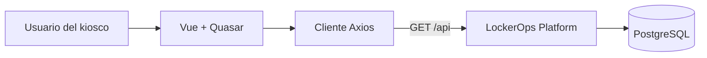

# LockerOps Kiosk

Interfaz de quiosco táctil para consultar estaciones de lockers y la
disponibilidad de sus compartimentos. Incluye un flujo de reserva para pruebas
locales; la demo pública del portfolio es de solo consulta y no procesa pagos.

[Abrir la demo pública](https://lockerops-kiosk-frontend-prod.onrender.com/stations)

El backend relacionado es
[LockerOps Platform](https://github.com/jaikostatham/lockerops-platform).

## Funcionalidades

- Selección de estaciones y consulta de compartimentos por estado.
- Vista de detalle de un compartimento.
- Interfaz en español e inglés, con español como idioma inicial.
- Diseño adaptado a pantallas táctiles.

## Tecnologías

Vue 3 · Quasar · TypeScript · Vue Router · Vue I18n · Axios · Vite

## Integración con la API

El catálogo consulta estas rutas:

- `GET /api/locker-stations`
- `GET /api/locker-stations/{id}`
- `GET /api/locker-stations/{lockerStationId}/compartments`
- `GET /api/locker-compartments/{id}`

El flujo de reserva local también puede usar `POST /api/reservations` y
`POST /api/access-codes/validate`. En la demo pública, la API limita las
operaciones al catálogo independientemente de la opción visual del frontend.
