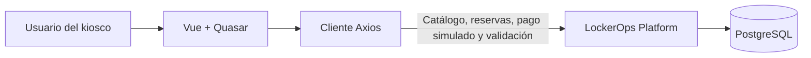

# LockerOps Kiosk

Interfaz de quiosco táctil para consultar estaciones de lockers y la
disponibilidad de sus compartimentos. Incluye un flujo de reserva, pago
simulado y emisión de ticket y código de acceso, disponible en local y en los
entornos desplegados cuando está habilitado.

[Abrir la demo pública](https://lockerops-kiosk-frontend-prod.onrender.com/stations)

El backend relacionado es
[LockerOps Platform](https://github.com/jaikostatham/lockerops-platform).

## Funcionalidades

- Selección de estaciones y consulta de compartimentos por estado.
- Vista de detalle de un compartimento.
- Reserva local con precio calculado, pago aprobado o rechazado simulado y
  emisión posterior del ticket y código de acceso.
- Interfaz en español e inglés, con español como idioma inicial.
- Diseño adaptado a pantallas táctiles.

## Tecnologías

Vue 3 · Quasar · TypeScript · Vue Router · Vue I18n · Axios · Vite

## Integración con la API

El catálogo consulta estas rutas:

- `GET /api/locker-stations`
- `GET /api/locker-stations/{id}`
- `GET /api/locker-stations/{lockerStationId}/compartments`
- `GET /api/locker-compartments/{id}`

El flujo crea la reserva con `POST /api/reservations`, procesa un resultado con
`POST /api/payments/simulate` y valida el código mediante
`POST /api/access-codes/validate`. El pago es una simulación: no solicita datos
reales de tarjeta ni realiza cobros. Las variables de entorno de cada backend
determinan qué base de datos recibe las operaciones. La API desplegada permite
estas rutas del quiosco y mantiene ocultas las rutas administrativas y las
consultas de colecciones privadas.

En desarrollo, Vite escucha en el puerto `9000` y reenvía `/api` a
`VITE_DEV_PROXY_TARGET`, cuyo valor predeterminado es
`http://localhost:8080`. El puerto del backend local debe coincidir con ese
destino. La visibilidad del flujo en la interfaz se controla con
`VITE_RESERVATION_FLOW_ENABLED` (por defecto, habilitado); esta opción visual
no sustituye las restricciones de la API.
